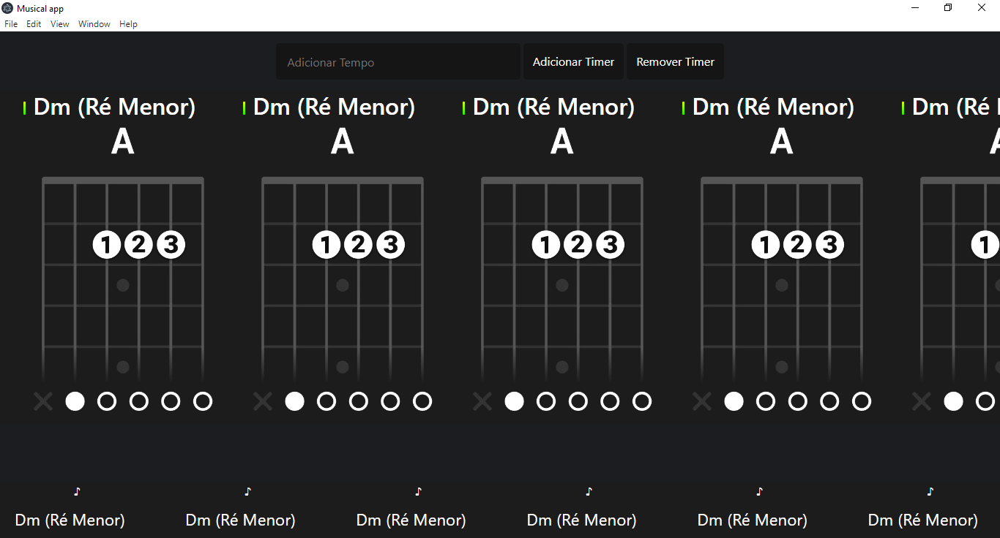
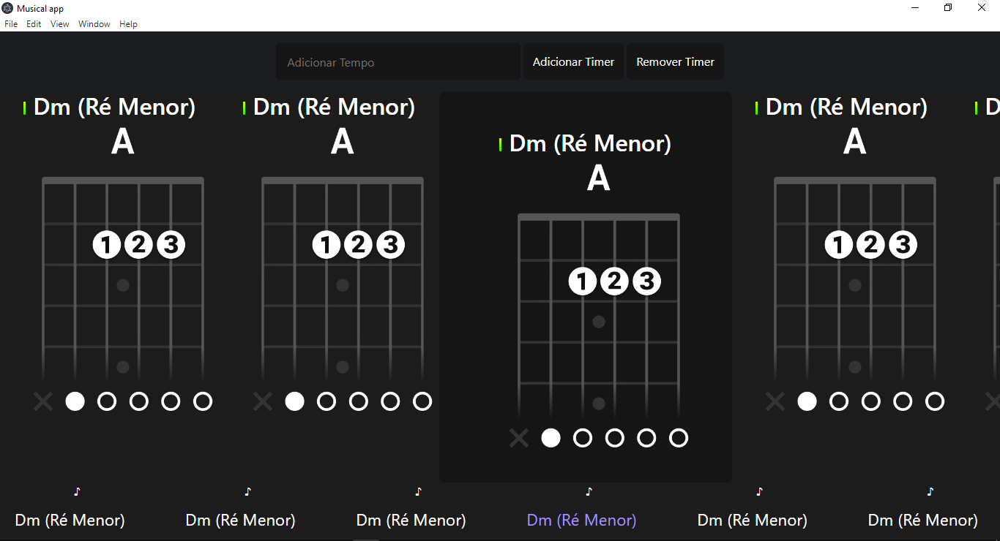

<h1>Apresentação</h1>

Um aplicativo criado para o aprendizado musical com enfase em troca de acordes para violão.

##

<h1>Modo de uso</h1>

Você pode adicionar um timer que ira trocar os acordes de maneira automatica para que o foco seja na troca de acordes.

Você também pode remove-lo a qualquer momento.

##

<h1>Prints da tela (imagens de exemplo)</h1>

